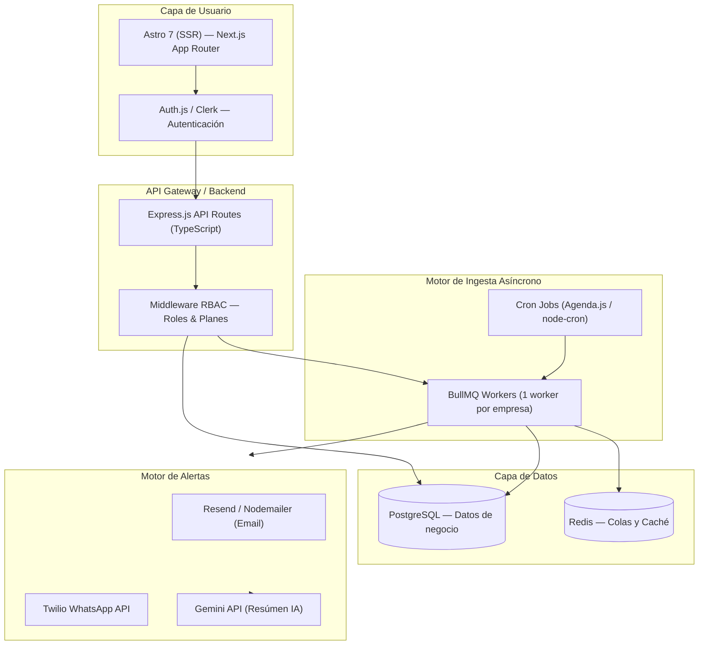

# Plan de Implementación: SaaS Radar de Licitaciones (Benthic OPS)

> **Última actualización:** Score de Recomendación Inteligente (Rubro + Región + Presupuesto + Urgencia) agregado.

---

## ✅ Decisiones Confirmadas

| Pregunta | Decisión |
| :--- | :--- |
| **Ticket API** | Por empresa. Ticket admin (`E18620F6-CC83-4690-96FC-CD61DC9FAE8D`) para testing. |
| **Pagos Stripe** | Integrado desde el día 1 (modo test primero). |
| **WhatsApp** | Twilio **sandbox** para desarrollo. Número verificado en fase de producción. |
| **Hosting** | Local en primera fase con `docker-compose`. Migración a VPS/Railway en producción. |
| **SSO (SAML)** | Fase 2. *(Ver sección «Qué es SSO» más abajo.)* |

---

## 🔑 ¿Qué es SSO (Single Sign-On)?

**SSO** (Inicio de Sesión Único) es una tecnología que permite que los empleados de una empresa **grande** entren a tu plataforma con las mismas credenciales de su empresa, sin crear una cuenta nueva.

**Ejemplo práctico:**
Una corporación como Arauco o el Ministerio de Salud ya tiene a sus 5.000 empleados registrados en **Microsoft Azure Active Directory** o **Google Workspace**. Con SSO/SAML configurado, el administrador de TI de esa empresa conecta su directorio corporativo con tu plataforma. Sus empleados hacen clic en "Entrar con Microsoft" y acceden directamente, sin que tú tengas que gestionar sus contraseñas.

```
Empleado Arauco                 Tu Plataforma          Azure AD (Arauco)
      │                               │                        │
      │── Hace clic en "Entrar" ──────▶│                        │
      │                               │── Redirige al SSO ────▶│
      │                               │                        │
      │◀────────────── Token SAML firmado ────────────────────│
      │                               │◀── Verifica token ─────│
      │                               │                        │
      │◀──── Sesión iniciada ─────────│                        │
```

**¿Por qué es Fase 2?**
Es una característica principalmente de clientes Enterprise. El 90% de tus primeros usuarios (PYMEs, medianas empresas) no lo necesitarán. Lo implementamos cuando tengas ese tipo de cliente.

---

Plataforma multi-tenant para monitoreo de licitaciones de Mercado Público con autenticación, planes de suscripción, roles, alertas y análisis IA.

---

## Contexto y Alcance

Construir un SaaS completo que permita a empresas chilenas:
- Registrarse con su empresa y rubro específico
- Aportar su propio **ticket de la API** de Mercado Público
- Monitorear licitaciones relevantes con IA
- Recibir alertas por **correo electrónico y/o WhatsApp**
- Tener acceso granular según su **plan de suscripción**

> [!IMPORTANT]
> **Arquitectura multi-tenant:** cada empresa (tenant) tiene sus datos completamente aislados. Sus tickets, licitaciones y alertas NO se mezclan con las de otra empresa.

---

## 🎯 Motor de Score de Recomendación (Benthic Intelligence Score)

Cada licitación recibe un **puntaje de 0 a 100** calculado automáticamente para cada empresa específica. El score se compone de **4 dimensiones**, ponderadas según su importancia real para ganar o no ganar un proceso.

### Fórmula del Score

```
Benthic Score = (Rubro × 0.40) + (Región × 0.30) + (Presupuesto × 0.20) + (Urgencia × 0.10)
```

### Dimensiones del Score

#### 1. 🏭 Compatibilidad de Rubro (40 puntos)

Compara el **rubro de la empresa** (guardado en `companies.industry`) contra las palabras clave del título, descripción y requerimientos técnicos de la licitación.

| Resultado | Puntos | Ejemplo |
| :--- | :---: | :--- |
| Coincidencia exacta del rubro | 40 | Empresa TI → Licitación "Desarrollo Software" |
| Rubro relacionado (≥1 keyword match) | 25 | Empresa TI → Licitación "Soporte Tecnológico" |
| Rubro periférico (industria amplia) | 10 | Empresa TI → Licitación "Consultoría Gestión" |
| Sin relación aparente | 0 | Empresa TI → Licitación "Construcción Camino" |

```typescript
// src/services/scoring/rubro.scorer.ts
export function scoreRubro(tender: Tender, company: Company): number {
  const keywords = getRubroKeywords(company.industry); // ['software', 'web', 'sistema', 'plataforma'...]
  const text = `${tender.title} ${tender.description}`.toLowerCase();
  const matches = keywords.filter(k => text.includes(k));
  if (matches.length >= 3) return 40;
  if (matches.length >= 1) return 25;
  if (isRelatedIndustry(company.industry, tender.category)) return 10;
  return 0;
}
```

#### 2. 📍 Proximidad Geográfica (30 puntos)

Compara la **región de la empresa** contra la región del organismo comprador de la licitación.

| Relación | Puntos | Razonamiento |
| :--- | :---: | :--- |
| **Misma región** | 30 | Alta probabilidad de logística viable y contacto presencial |
| **Región limítrofe** | 20 | Viable con leve costo de desplazamiento |
| **Macrozona** (Norte/Centro/Sur) | 12 | Posible, pero eleva costos y baja competitividad |
| **País entero / Sin región** | 5 | Licitación nacional, cualquier empresa puede postular |
| **Región distante** | 0 | Logística muy costosa, poco competitivo |

```typescript
// src/services/scoring/region.scorer.ts

// Mapa de regiones de Chile con relaciones de proximidad
const CHILE_REGIONS: Record<string, RegionMeta> = {
  'RM':   { zone: 'centro', neighbors: ['V', 'VI', 'VII'] },
  'V':    { zone: 'centro', neighbors: ['RM', 'IV', 'VI'] },
  'VIII': { zone: 'sur',    neighbors: ['VII', 'IX', 'XIV'] },
  // ... todas las 16 regiones
};

export function scoreRegion(tender: Tender, company: Company): number {
  const tenderRegion = extractRegionCode(tender.buyer_region);
  const companyRegion = company.region;
  if (tenderRegion === companyRegion) return 30;
  if (CHILE_REGIONS[companyRegion]?.neighbors.includes(tenderRegion)) return 20;
  if (CHILE_REGIONS[companyRegion]?.zone === CHILE_REGIONS[tenderRegion]?.zone) return 12;
  if (!tenderRegion || tenderRegion === 'NACIONAL') return 5;
  return 0;
}
```

> [!NOTE]
> **Mapa de Macrozonales de Chile:**
> - **Norte Grande:** I (Tarapacá), II (Antofagasta), XV (Arica)
> - **Norte Chico:** III (Atacama), IV (Coquimbo)
> - **Centro:** RM, V (Valparaíso), VI (O'Higgins)
> - **Centro-Sur:** VII (Maule), VIII (Biobío), XVI (Ñuble)
> - **Sur:** IX (Araucanía), XIV (Los Ríos), X (Los Lagos)
> - **Austral:** XI (Aysén), XII (Magallanes)

#### 3. 💰 Compatibilidad de Presupuesto (20 puntos)

Evalúa si el presupuesto de la licitación es razonable para el tamaño y capacidad de la empresa.

> [!NOTE]
> La empresa define en su perfil su **rango operacional** (presupuesto mínimo y máximo que puede asumir).

| Situación | Puntos |
| :--- | :---: |
| Dentro del rango ideal de la empresa | 20 |
| Ligeramente mayor al rango (≤ 150%) | 12 |
| Bastante sobre el rango (> 150%) | 5 |
| Bajo el mínimo de la empresa | 8 |
| Sin presupuesto declarado | 10 (neutro) |

#### 4. ⏰ Urgencia Temporal (10 puntos)

Mide los días disponibles para preparar la oferta.

| Días hasta cierre | Puntos | Señal |
| :--- | :---: | :--- |
| ≥ 15 días | 10 | ✅ Tiempo cómodo para preparar |
| 7 – 14 días | 7 | ⚠️ Plazo ajustado |
| 3 – 6 días | 3 | 🔴 Riesgo alto de oferta apresurada |
| < 3 días | 0 | ⛔ Prácticamente inviable |

---

### Visualización del Score en el Dashboard

Cada tarjeta de licitación muestra el **Benthic Score** con un indicador visual de 3 niveles:

```
╔══════════════════════════════════════════════════════╗
║  🎯 BENTHIC SCORE: 78/100         ██████████░░  ✅ RECOMENDADA  ║
╠══════════════════════════════════════════════════════╣
║  🏭 Rubro       ████████████████░░░░  40/40  ✅         ║
║  📍 Región      ████████████░░░░░░░░  20/30  ⚠️ Region limítrofe ║
║  💰 Presupuesto ████████░░░░░░░░░░░░  12/20  ⚠️ Sobre tu rango  ║
║  ⏰ Urgencia    ██████░░░░░░░░░░░░░░   6/10  ✅ 8 días disponibles║
╚══════════════════════════════════════════════════════╝

  🤖 Análisis Benthic IA:
  "Esta licitación es altamente compatible con tu rubro (Desarrollo TI).
  La región de Valparaíso es accesible desde tu sede en la RM. El
  presupuesto de $18M CLP supera en un 20% tu rango típico. Tienes
  8 días para preparar una propuesta competitiva."
```

### Niveles de Recomendación

| Score | Nivel | Descripción |
| :--- | :--- | :--- |
| **80 – 100** | 🟢 **Muy Recomendada** | Alta compatibilidad en todas las dimensiones |
| **60 – 79** | 🟡 **Recomendada** | Buena oportunidad con alguna limitación menor |
| **40 – 59** | 🟠 **Evaluar** | Requiere análisis adicional antes de postular |
| **0 – 39** | 🔴 **Poco Recomendada** | Baja compatibilidad, alto riesgo logístico o sectorial |

---

### Filtros de Región Inteligentes

En el Dashboard, el usuario puede filtrar por región usando el selector o directamente desde el mapa interactivo de Chile:

```typescript
// Filtro de región en el endpoint /api/tenders
type TenderFilters = {
  regions?:     string[];   // ['RM', 'V', 'VIII']  — Multi-selección
  onlyReachable?: boolean;  // Solo regiones alcanzables para la empresa
  minScore?:    number;     // Solo licitaciones con score >= X
  status?:      string[];   // ['Publicada', 'Cerrada']
  keywords?:    string;     // Búsqueda full-text
  minBudget?:   number;
  maxBudget?:   number;
  closingIn?:   number;     // Días hasta cierre ≤ X
};
```

### Columnas Adicionales en la tabla `tenders`

```sql
-- Campos de scoring a agregar a la tabla tenders
ALTER TABLE tenders ADD COLUMN buyer_region    TEXT;           -- 'Región Metropolitana'
ALTER TABLE tenders ADD COLUMN buyer_region_code TEXT;         -- 'RM'
ALTER TABLE tenders ADD COLUMN score_total     INT DEFAULT 0;  -- 0-100
ALTER TABLE tenders ADD COLUMN score_rubro     INT DEFAULT 0;  -- 0-40
ALTER TABLE tenders ADD COLUMN score_region    INT DEFAULT 0;  -- 0-30
ALTER TABLE tenders ADD COLUMN score_budget    INT DEFAULT 0;  -- 0-20
ALTER TABLE tenders ADD COLUMN score_urgency   INT DEFAULT 0;  -- 0-10
ALTER TABLE tenders ADD COLUMN score_label     TEXT;           -- 'Muy Recomendada'
ALTER TABLE tenders ADD COLUMN scored_at       TIMESTAMPTZ;    -- Cuándo se calculó
```

---

## Arquitectura General



---

## Modelo de Datos (PostgreSQL)

### Esquema de Tablas Principales

```sql
-- Empresas (Tenants)
CREATE TABLE companies (
  id          UUID PRIMARY KEY DEFAULT gen_random_uuid(),
  name        TEXT NOT NULL,
  rut         TEXT UNIQUE NOT NULL,
  industry    TEXT,              -- Rubro (ej: "Tecnología", "Construcción")
  api_ticket  TEXT,              -- Ticket personal de Mercado Público
  plan        plan_type NOT NULL DEFAULT 'starter',
  created_at  TIMESTAMPTZ DEFAULT NOW()
);

-- Usuarios de cada empresa
CREATE TABLE users (
  id           UUID PRIMARY KEY DEFAULT gen_random_uuid(),
  company_id   UUID REFERENCES companies(id) ON DELETE CASCADE,
  email        TEXT UNIQUE NOT NULL,
  name         TEXT NOT NULL,
  role         user_role NOT NULL DEFAULT 'viewer',  -- owner, admin, analyst, viewer
  created_at   TIMESTAMPTZ DEFAULT NOW()
);

-- Licitaciones cacheadas por empresa
CREATE TABLE tenders (
  id              UUID PRIMARY KEY DEFAULT gen_random_uuid(),
  company_id      UUID REFERENCES companies(id) ON DELETE CASCADE,
  external_code   TEXT NOT NULL,        -- Ej: "1067476-19-LE26"
  title           TEXT NOT NULL,
  status          TEXT,                 -- Publicada, Cerrada, Adjudicada...
  budget          NUMERIC,
  close_date      TIMESTAMPTZ,
  buyer_name      TEXT,
  raw_data        JSONB,                -- Payload completo de la API
  ai_summary      TEXT,                -- Resumen generado por Gemini
  ai_score        INT,                  -- Score 0-100 de relevancia
  created_at      TIMESTAMPTZ DEFAULT NOW(),
  UNIQUE(company_id, external_code)
);

-- Alertas configuradas por usuario
CREATE TABLE alerts (
  id             UUID PRIMARY KEY DEFAULT gen_random_uuid(),
  user_id        UUID REFERENCES users(id) ON DELETE CASCADE,
  company_id     UUID REFERENCES companies(id) ON DELETE CASCADE,
  channel        alert_channel NOT NULL,   -- 'email', 'whatsapp'
  trigger_type   TEXT NOT NULL,            -- 'new_tender', 'closing_soon', 'adjudicated'
  filters        JSONB,                    -- { "keywords": ["web","tecnologia"], "min_budget": 5000000 }
  is_active      BOOLEAN DEFAULT TRUE,
  created_at     TIMESTAMPTZ DEFAULT NOW()
);

-- Log de notificaciones enviadas
CREATE TABLE notification_log (
  id            UUID PRIMARY KEY DEFAULT gen_random_uuid(),
  alert_id      UUID REFERENCES alerts(id),
  tender_id     UUID REFERENCES tenders(id),
  sent_at       TIMESTAMPTZ DEFAULT NOW(),
  channel       TEXT,
  status        TEXT   -- 'sent', 'failed', 'rate_limited'
);

-- Enumeraciones
CREATE TYPE plan_type AS ENUM ('starter', 'growth', 'enterprise');
CREATE TYPE user_role AS ENUM ('owner', 'admin', 'analyst', 'viewer');
CREATE TYPE alert_channel AS ENUM ('email', 'whatsapp');
```

---

## Planes de Suscripción y Límites

| Característica | Starter (Gratis) | Growth | Enterprise |
| :--- | :---: | :---: | :---: |
| **Usuarios por empresa** | 1 | 5 | Ilimitados |
| **Licitaciones en radar** | 50 / mes | 500 / mes | Ilimitadas |
| **Alertas** | 2 (solo email) | 10 (email + WA) | Ilimitadas |
| **Resumen IA por licitación** | ❌ | ✅ | ✅ + Reporte completo |
| **Exportar a PDF/Excel** | ❌ | ✅ | ✅ |
| **API propio (ticket)** | ✅ | ✅ | ✅ |
| **Roles de usuario** | Solo owner | owner + admin | Todos los roles |
| **Soporte** | Solo FAQ | Email | Prioritario |
| **Precio** | $0 | ~$30 USD/mes | Cotización |

### Roles de Usuario y Permisos

| Permiso | Owner | Admin | Analyst | Viewer |
| :--- | :---: | :---: | :---: | :---: |
| Ver licitaciones | ✅ | ✅ | ✅ | ✅ |
| Configurar alertas propias | ✅ | ✅ | ✅ | ❌ |
| Gestionar alertas del equipo | ✅ | ✅ | ❌ | ❌ |
| Invitar usuarios | ✅ | ✅ | ❌ | ❌ |
| Ver resúmenes IA | ✅ | ✅ | ✅ | ❌ |
| Exportar datos | ✅ | ✅ | ✅ | ❌ |
| Configurar ticket API | ✅ | ✅ | ❌ | ❌ |
| Acceder a facturación | ✅ | ❌ | ❌ | ❌ |

---

## Cambios Propuestos (Archivos)

Proyecto nuevo en `/Users/teddy/Documents/Benthic OPS/Benthic Mercado Publico`.

### Base del Proyecto

#### [NEW] package.json
Dependencias core del monorepo:
```json
{
  "dependencies": {
    "astro": "^7",
    "@auth/core": "^0.37",
    "bullmq": "^5",
    "ioredis": "^5",
    "drizzle-orm": "^0.44",
    "postgres": "^3",
    "drizzle-kit": "^0.31",
    "resend": "^4",
    "twilio": "^5",
    "@google/genai": "^1",
    "stripe": "^17",
    "zod": "^3",
    "node-cron": "^3"
  }
}
```

---

### Autenticación

#### [NEW] src/lib/auth.ts
Configuración de **Auth.js** con providers de Google, GitHub y **Magic Link (email)**.

```typescript
// Estrategia: Magic Link + OAuth
// Cada sesión incluye: user.id, user.role, user.companyId, user.plan
```

---

### API Backend (Endpoints SSR en Astro)

#### [NEW] src/pages/api/tenders/index.ts
Endpoint de listado de licitaciones con filtros, paginación y validación del plan:
```
GET /api/tenders?status=Publicada&keyword=web&page=1
Authorization: Session cookie
→ Valida plan → Aplica límites → Consulta PostgreSQL → Retorna JSON
```

#### [NEW] src/pages/api/tenders/[id].ts
Detalle de licitación + resumen IA (requiere plan Growth o superior).

#### [NEW] src/pages/api/alerts/index.ts
CRUD de alertas del usuario autenticado, con validación de límites del plan.

#### [NEW] src/pages/api/company/ticket.ts
Endpoint para guardar/actualizar el ticket de Mercado Público de la empresa.

---

### Motor de Ingesta (Workers)

#### [NEW] src/workers/ingestion.worker.ts
Worker de BullMQ que se activa cada vez que un job entra en la cola:
1. Toma el `company_id` y el `ticket` del job.
2. Llama a `https://api.mercadopublico.cl/servicios/v1/publico/licitaciones.json?fecha=HOY&ticket=XXX`
3. Parsea las licitaciones nuevas.
4. Hace *upsert* en la tabla `tenders`.
5. Encola jobs de `alert-check` para cada nueva licitación.

#### [NEW] src/workers/alert.worker.ts
Worker que para cada nueva licitación:
1. Busca las alertas activas de la empresa que coincidan con los filtros (`JSONB @>` query en PostgreSQL).
2. Si hay coincidencia → genera resumen IA (Gemini) → envía notificación por el canal configurado.

#### [NEW] src/scheduler.ts
Cron Job que cada 15 minutos encola un job en BullMQ por cada empresa activa con ticket configurado:
```typescript
cron.schedule('*/15 * * * *', async () => {
  const companies = await db.query.companies.findMany({
    where: and(isNotNull(schema.companies.api_ticket), isActive(plan))
  });
  for (const company of companies) {
    await ingestionQueue.add('fetch-tenders', { companyId: company.id, ticket: company.api_ticket });
  }
});
```

---

### Servicios de Alertas

#### [NEW] src/services/email.service.ts
Integración con **Resend** (moderno, TypeScript-first, mejor alternativa a SendGrid):
- Templates en React Email para los diferentes tipos de alerta.

#### [NEW] src/services/whatsapp.service.ts
Integración con **Twilio WhatsApp Business API**:
- Mensaje de alerta en formato estructurado.
- Requiere número verificado en Twilio.

#### [NEW] src/services/gemini.service.ts
Wrapper del SDK de Gemini para:
1. **Análisis de licitación:** Dado el JSON de la licitación, retorna score de relevancia y resumen ejecutivo de 3 párrafos en español.
2. **Reporte de rubro:** Para empresas Enterprise, reporte mensual de tendencias del mercado en su sector.

---

### Frontend / Dashboard

#### [NEW] src/pages/dashboard/index.astro
Dashboard principal con:
- KPIs del día (nuevas licitaciones, cierres próximos, oportunidades IA).
- Tabla interactiva con licitaciones filtradas.
- Widget de "Score de Oportunidad" por licitación.

#### [NEW] src/pages/dashboard/[id].astro
Ficha de licitación (SSR) con:
- Datos completos del proceso.
- Resumen IA generado por Gemini.
- Documentos adjuntos del portal.
- Botón de "Agregar a Mis Oportunidades".

#### [NEW] src/pages/dashboard/alertas.astro
Panel de configuración de alertas con:
- Toggle de activación por canal (email / WhatsApp).
- Configurador de filtros de palabras clave y monto mínimo.
- Log de las últimas notificaciones enviadas.

#### [NEW] src/pages/dashboard/equipo.astro
Gestión de usuarios de la empresa (solo owner/admin):
- Invitar por email.
- Asignar rol (admin, analyst, viewer).
- Ver actividad del equipo.

#### [NEW] src/pages/dashboard/configuracion.astro
Configuraciones de la empresa:
- Actualizar ticket de Mercado Público.
- Información de la empresa y rubro.
- Sección de facturación / plan (integrada con Stripe).

---

## Stack Tecnológico Final Confirmado

| Capa | Tecnología | Justificación |
| :--- | :--- | :--- |
| **Frontend / SSR** | Astro 7 + Tailwind 4 | Mismo stack que el sitio Benthic OPS existente. |
| **Componentes Dinámicos** | React (Astro Islands) | Para buscador, filtros y gráficos en tiempo real. |
| **Auth** | Auth.js (con Astro) | Magic Link + OAuth. Manejo de sesiones seguro. |
| **ORM / DB Schema** | Drizzle ORM + PostgreSQL | Type-safe, migraciones simples, JSONB nativo. |
| **Colas** | BullMQ | Reintentos, concurrencia, priorización de jobs. |
| **Caché / Colas storage** | Redis (Upstash en prod) | Cero configuración en producción con Upstash. |
| **Email** | Resend + React Email | Templates atractivos en React, API simple. |
| **WhatsApp** | Twilio API | Estándar para WhatsApp Business en producción. |
| **Pagos** | Stripe | Checkout, suscripciones y webhooks de plan. |
| **IA** | Gemini 1.5 Flash | Contexto largo para analizar bases completas (PDFs). |
| **Deploy** | Railway (backend) + Vercel / Cloudflare (frontend) | Railway para PostgreSQL + workers; Vercel o CF Pages para Astro. |

---

## Preguntas Abiertas

> [!IMPORTANT]
> Necesito confirmar estos puntos antes de iniciar el desarrollo:

1. **¿El ticket de API es de la empresa o de cada usuario?**
   En el plan propuesto, el ticket es **de la empresa** (un solo ticket por organización). ¿O prefieres que cada usuario tenga el suyo propio?

2. **¿Integración de pagos desde el día 1?**
   ¿Quieres incluir la lógica de Stripe (suscripciones, webhooks, portal de facturación) desde el inicio, o primero construimos la plataforma y luego integramos los pagos?

3. **¿Número de WhatsApp propio?**
   Twilio requiere un número de teléfono específico para WhatsApp Business. ¿Tienes uno ya verificado o necesitamos configurar uno nuevo (+56 xxx)?

4. **¿Quieres SSO (inicio de sesión de empresa) o solo email/Google?**
   Para empresas Enterprise, es común ofrecer SAML SSO. ¿Lo necesitas ahora o es para una fase posterior?

5. **¿Hosting?**
   ¿Prefieres una VPS tuya (Hetzner/DigitalOcean) para máximo control y costo, o servicios gestionados (Railway + Vercel) para velocidad de desarrollo?
