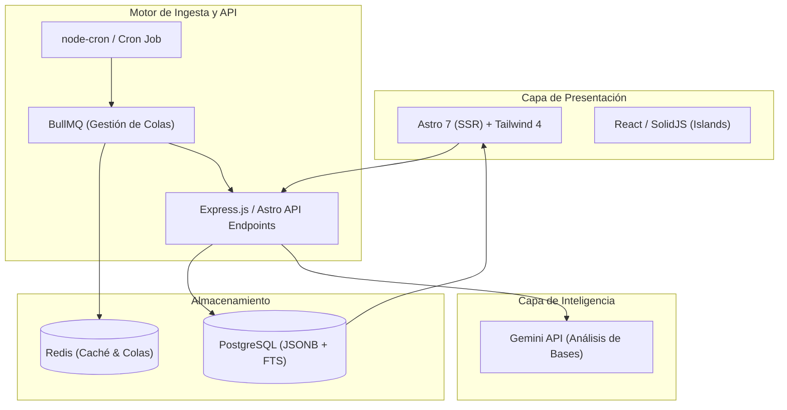

# Análisis Profundo de Tecnologías: Radar de Licitaciones

Este documento analiza en detalle las alternativas tecnológicas para el desarrollo de la plataforma SaaS de **Radar de Licitaciones** de **Benthic OPS**, contrastando opciones para el motor de ingesta, la gestión de colas, la base de datos y la interfaz de usuario.

---

## 📊 Resumen de la Recomendación

Para un sistema que requiere consultar APIs de terceros cada 15 minutos, procesar datos asíncronamente y presentarlos en una interfaz moderna y rápida, la arquitectura recomendada es **TypeScript + Node.js Monorepo**:



---

## 1. Capa de Datos e Ingesta (Backend)

La tarea crítica es consultar la API de Mercado Público cada 15 minutos, procesar los resultados sin bloquear la aplicación y manejar los límites de tasa (rate limits).

### Alternativas de Lenguaje

| Criterio | Node.js (TypeScript) - *Recomendado* | Python | Go |
| :--- | :--- | :--- | :--- |
| **Rendimiento** | Alto (Asíncrono por defecto) | Medio (Sujeto al GIL) | Extremo (Compilado, muy bajo consumo) |
| **Ecosistema de I/O** | Excelente (Axios, Fetch, Streams) | Excelente (Requests, Scrapy) | Muy bueno |
| **Integración IA** | Excelente (Gemini SDK, LangChain.js) | Nativo (Líder en IA/ML) | Limitado (SDKs básicos) |
| **Curva de Aprendizaje** | Mínima (Comparte stack con Astro) | Baja | Media (Estructura rígida) |

> [!TIP]
> **Decisión:** **Node.js (TypeScript)**. Permite compartir tipos (interfaces de datos) entre el backend de ingesta y el frontend en Astro. Su naturaleza asíncrona es ideal para manejar cientos de llamadas HTTP concurrentes sin consumir demasiada memoria.

---

## 2. Gestión de Colas y Tareas Asíncronas

Cuando el Cron Job detecta nuevas licitaciones, no se pueden procesar todas en un solo hilo HTTP. Se requiere una cola asíncrona.

### Comparativa de Sistemas de Colas

```
                  [ Tareas Entrantes (API) ]
                              │
                              ▼
                      ┌───────────────┐
                      │    BullMQ     │
                      └───────┬───────┘
                              │
               ┌──────────────┼──────────────┐
               ▼              ▼              ▼
         ┌───────────┐  ┌───────────┐  ┌───────────┐
         │ Worker 01 │  │ Worker 02 │  │ Worker 03 │  (Procesamiento asíncrono)
         └─────┬─────┘  └─────┬─────┘  └─────┬─────┘
               └──────────────┼──────────────┘
                              ▼
                     [ PostgreSQL / DB ]
```

* **Opción 1: BullMQ + Redis (Recomendada)**
  - *Cómo funciona:* Usa Redis como almacenamiento ultra-rápido en memoria para persistir la cola de tareas.
  - *Ventajas:* Excelente soporte para TypeScript, reintentos automáticos configurables con *exponential backoff*, control de concurrencia y retraso de tareas (esencial para respetar la tasa límite de Mercado Público).
* **Opción 2: Celery + Redis / RabbitMQ (Python)**
  - *Ventajas:* Robusto y maduro.
  - *Desventajas:* Sobrecarga de configuración y requiere mantener un entorno Python complejo solo para la cola.
* **Opción 3: Go Channels**
  - *Ventajas:* Sin dependencias externas (no requiere Redis).
  - *Desventajas:* Si el contenedor del servidor se cae, las tareas en memoria se pierden. No tiene persistencia nativa.

> [!IMPORTANT]
> **Recomendación:** **BullMQ sobre Redis**. Proporciona la resiliencia necesaria para el scraping (si la API de Mercado Público falla a mitad de la llamada, BullMQ reintenta la tarea automáticamente 3 minutos después).

---

## 3. Base de Datos (Persistencia)

Las licitaciones tienen metadatos muy estructurados (IDs, RUTs, fechas) pero también datos variables e impredecibles (anexos, requerimientos específicos).

### Alternativas de Base de Datos

* **PostgreSQL + JSONB (Recomendado)**
  - *Por qué:* Combina lo mejor de dos mundos. Permite realizar consultas relacionales ultra-rápidas en columnas fijas (ID, Estado, Presupuesto) y almacenar la respuesta cruda de la API de Mercado Público en una columna de tipo `JSONB` indexable.
  - *Búsqueda:* Soporta Full-Text Search (FTS) nativo en español para buscar palabras clave como "desarrollo web", "soporte", etc.
* **MongoDB (NoSQL)**
  - *Por qué:* Muy fácil para guardar JSONs directos de la API.
  - *Problema:* Menos eficiente para reportes consolidados complejos, analítica agregada (para el "Termómetro de Mercado") y relaciones de usuarios/clientes del SaaS.

---

## 4. Frontend e Interfaz de Usuario (Dashboard)

Dado que el sitio corporativo de **Benthic OPS** está construido en **Astro 7 + Tailwind 4**, integrar el dashboard aquí ofrece ventajas inigualables de sinergia de código.

```
📁 Proyecto Monorepo (Astro + Tailwind 4)
├── 📁 src/
│   ├── 📁 pages/
│   │   ├── 📄 index.astro        (Landing page)
│   │   └── 📁 dashboard/
│   │       ├── 📄 index.astro    (Dashboard principal - SSR)
│   │       └── 📄 [id].astro     (Ficha de licitación - SSR)
│   └── 📁 components/
│       ├── ⚛️ MetricCharts.tsx    (React/Solid - Gráficos dinámicos)
│       └── ⚛️ SearchConsole.tsx  (Consola de filtros dinámicos)
```

### Opciones de Integración Frontend

1. **Astro 7 con SSR (Server-Side Rendering) + React/SolidJS (Recomendada):**
   - *Por qué:* Astro permite renderizar la estructura del dashboard en el servidor para máxima velocidad y seguridad de datos (las claves de API no se exponen al cliente). Para componentes muy dinámicos (el buscador interactivo o los gráficos del Termómetro de Mercado), se usan "islas de interactividad" en React o SolidJS con la directiva `client:load`.
   - *Beneficio clave:* Una sola base de código, mismas fuentes auto-hospedadas, misma configuración de Tailwind 4 y facilidad de despliegue.
2. **Next.js (App Router):**
   - *Por qué:* Estándar industrial para dashboards dinámicos.
   - *Desventajas:* Requiere configurar un subdominio separado (ej. `radar.benthicops.cl`), duplicar la configuración de diseño de Tailwind 4 y duplicar los layouts.

---

## 5. Capa de Inteligencia Artificial (Análisis de Bases)

Para el análisis de las extensas bases de licitación (fichas de 40+ páginas):
* **Gemini 1.5 Pro / Flash API (a través de Node.js):**
  - *Ventajas:* Contexto de hasta 2 millones de tokens (ideal para subir múltiples PDFs de bases completas).
  - *Implementación:* Mediante el SDK `@google/genai` en el backend, llamando al modelo de forma asíncrona dentro de una tarea de BullMQ y guardando el reporte estructurado en JSON en la base de datos PostgreSQL.
