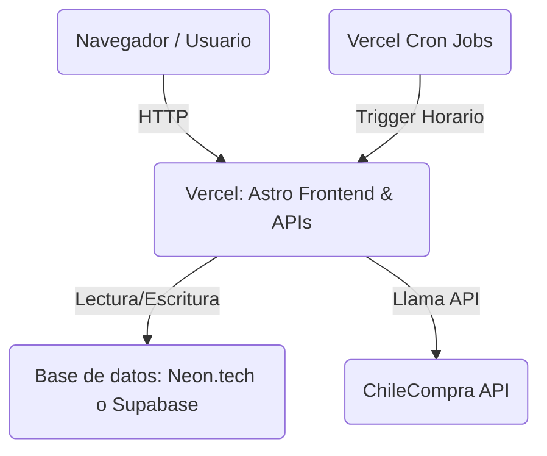

# Guía de Despliegue 100% Gratuito en Vercel (Serverless)

Esta guía detalla los pasos para alojar **VC Elemental MP** en la nube de forma **totalmente gratuita ($0/mes)**, sin depender de que tu ordenador esté encendido y sin necesidad de pagar servidores persistentes para las colas de Redis/BullMQ.

---

## 🏛️ Arquitectura del Despliegue Gratuito

Para evitar pagar servidores 24/7, hemos optimizado el sistema para que funcione en arquitectura **Serverless**:



1. **Astro + APIs**: Alojados en **Vercel** (Capa gratuita).
2. **Base de Datos (PostgreSQL)**: Alojada en **Neon.tech** o **Supabase** (Capa gratuita de Postgres).
3. **Sincronización (Scheduler)**: En lugar de tener un worker continuo con Redis, usamos **Vercel Cron Jobs** que despiertan las rutas `/api/sync` y `/api/sync-full` automáticamente para actualizar los datos.

---

## 🛠️ Paso 1: Crear la Base de Datos en la Nube (Gratis)

Elige uno de los dos proveedores gratuitos líderes de PostgreSQL:

### Opción A: Neon.tech (Recomendado por velocidad)
1. Regístrate gratis en [Neon.tech](https://neon.tech/).
2. Crea un nuevo proyecto llamado `vc-elemental-mp`.
3. Elige la base de datos PostgreSQL v16.
4. Copia la cadena de conexión de tipo **Pooled** (suele empezar con `postgresql://vcelemental...`).

### Opción B: Supabase
1. Regístrate gratis en [Supabase.com](https://supabase.com/).
2. Crea un nuevo proyecto y guarda bien la contraseña de la base de datos.
3. Ve a **Project Settings** > **Database** y copia la URI de conexión de la sección **Connection String** > **URI** (modo `Transaction` / puerto `6543`).

---

## 🚀 Paso 2: Crear el Repositorio e Inicializar las Tablas

1. Sube tu código de VC Elemental a un repositorio privado de **GitHub**.
2. Corre las migraciones de base de datos desde tu terminal local hacia la base de datos de la nube por única vez para crear las tablas físicas:
   ```bash
   DATABASE_URL="TU_CONEXION_DE_NEON_O_SUPABASE" npm run db:push
   ```
3. Opcionalmente, siembra los datos del dueño de la empresa:
   ```bash
   DATABASE_URL="TU_CONEXION_DE_NEON_O_SUPABASE" npm run db:seed
   ```

---

## 🌐 Paso 3: Conectar el proyecto a Vercel

1. Ve a [Vercel.com](https://vercel.com/) e inicia sesión con tu cuenta de GitHub.
2. Haz clic en **Add New** > **Project**.
3. Importa el repositorio `vc-elemental-mp` de tu cuenta de GitHub.
4. **Environment Variables**: En la sección de variables de entorno de Vercel, agrega las siguientes:
   
   | Variable | Valor / Descripción |
   | :--- | :--- |
   | `DATABASE_URL` | La URI de conexión de Neon o Supabase copiada en el Paso 1. |
   | `MP_ADMIN_TICKET` | Tu ticket de acceso a la API de Mercado Público (`E18620F6-...`). |
   | `CRON_SECRET` | Una clave secreta alfanumérica aleatoria que crees (sirve para asegurar los endpoints de sincronización y que nadie externo pueda saturar tu cuota de API). |
   | `NODE_ENV` | `production` |
   | `GEMINI_API_KEY` | (Opcional) Tu API key de Google AI Studio para los resúmenes automáticos. |

5. Haz clic en **Deploy**. ¡Vercel compilará y desplegará tu app en pocos segundos!

---

## ⏰ Paso 4: Activación de los Cron Jobs Automáticos

Vercel detectará el archivo `vercel.json` de la raíz del proyecto y creará los Cron Jobs en tu panel:

1. **Sincronización Rápida (`/api/sync`)**: Se ejecuta automáticamente **cada hora** (`0 * * * *`). Trae y analiza las novedades del día (hoy) en tiempo de ejecución ultra rápido (2-5 segundos).
2. **Sincronización Completa (`/api/sync-full`)**: Se ejecuta automáticamente **a las 2:00 AM cada noche** (`0 2 * * *`). Realiza un barrido completo del historial de los últimos 45 días laborales para mantener la base de datos al día.

> [!NOTE]
> Al configurar la variable `CRON_SECRET` en Vercel, este enviará automáticamente una cabecera `Authorization: Bearer <CRON_SECRET>` en cada llamada del Cron, impidiendo que terceros ejecuten la sincronización de forma no autorizada.

¡Listo! Con esto, tu sistema de VC Elemental ya funciona de forma autónoma en la nube, es gratuito y no depende de que tu PC esté encendida.
