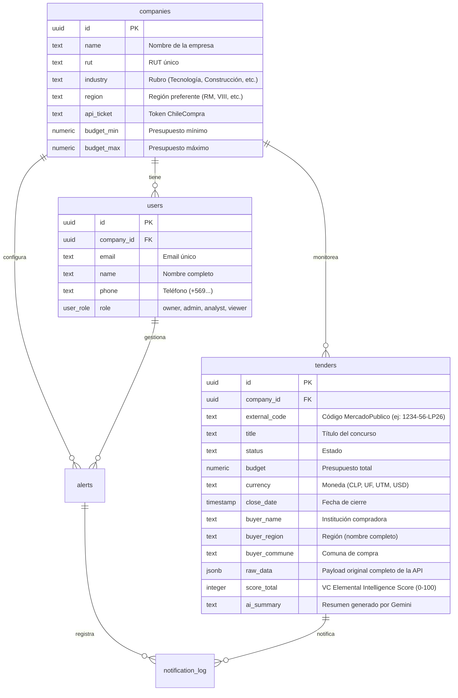

# Guía Técnica: API Mercado Público y Acceso a Datos (VC Elemental MP)

Esta guía detalla el funcionamiento del motor de ingesta de **VC Elemental MP**, la interacción con la API de Mercado Público de ChileCompra, la estructura de la base de datos (PostgreSQL + Drizzle ORM) y cómo realizar consultas o modificaciones si deseas expandir el sistema.

---

## 🏛️ 1. API de Mercado Público (ChileCompra)

El cliente oficial para interactuar con la API está implementado en [mercadopublico.ts](file:///Users/teddy/Library/CloudStorage/OneDrive-Personal/Documentos/Documentos%20Jose%20Valdes/Proyectos/VC%20Elemental/src/services/mercadopublico.ts).

### Endpoint Base
```
GET https://api.mercadopublico.cl/servicios/v1/publico/licitaciones.json
```

### Parámetros de Consulta Clave
| Parámetro | Tipo | Descripción | Ejemplo |
| :--- | :--- | :--- | :--- |
| `ticket` | String | **Obligatorio.** API Key / Token de ChileCompra. | `ticket=E18620F6...` |
| `codigo` | String | Código único de licitación (Ficha detallada). | `codigo=1067476-19-LE26` |
| `estado` | Número | Filtro por estado: `5` (Publicada), `6` (Cerrada), `8` (Adjudicada). | `estado=5` |
| `fecha` | String | Fecha de publicación en formato **DDMMAAAA**. | `fecha=11072026` |
| `pagina` | Número | Paginador (comienza en 1). | `pagina=2` |

> [!IMPORTANT]
> **Bloqueo por AWS WAF y Cabecera User-Agent**:
> La API de Mercado Público bloquea por defecto las solicitudes de clientes HTTP genéricos (como node fetch) devolviendo errores `403 Forbidden` o `503 Service Unavailable`.
> Para evitar esto, **es obligatorio enviar una cabecera `User-Agent` simulando un navegador moderno** en cada solicitud.
> Ejemplo en nuestro cliente:
> ```typescript
> headers: {
>   'User-Agent': 'Mozilla/5.0 (Macintosh; Intel Mac OS X 10_15_7) AppleWebKit/537.36...',
>   'Accept': 'application/json'
> }
> ```

---

## 📊 2. Estructura de Base de Datos (Drizzle ORM)

El esquema relacional completo está definido en [schema.ts](file:///Users/teddy/Library/CloudStorage/OneDrive-Personal/Documentos/Documentos%20Jose%20Valdes/Proyectos/VC%20Elemental/src/db/schema.ts).

### Principales Tablas:



---

## 💻 3. Cómo Consultar y Acceder a los Datos en Código

Si quieres añadir nuevas funciones, aquí tienes ejemplos prácticos usando Drizzle ORM dentro del proyecto:

### Obtener Licitaciones Recomendadas (Score >= 70) para la Empresa Activa
```typescript
import { db, tenders } from './src/db/index';
import { and, eq, gte, desc } from 'drizzle-orm';

const recommendedTenders = await db
  .select()
  .from(tenders)
  .where(
    and(
      eq(tenders.companyId, activeCompanyId),
      gte(tenders.scoreTotalVal, 70)
    )
  )
  .orderBy(desc(tenders.scoreTotalVal));
```

### Actualizar Filtros Operacionales de la Empresa
```typescript
import { db, companies } from './src/db/index';
import { eq } from 'drizzle-orm';

await db
  .update(companies)
  .set({
    industry: 'Construcción',
    region: 'VIII',
    budgetMin: '15000000',
    budgetMax: '90000000',
  })
  .where(eq(companies.id, companyId));
```

---

## 🔄 4. Proceso de Sincronización Directa (`sync_direct.ts`)

Ubicación del script: [sync_direct.ts](file:///Users/teddy/Library/CloudStorage/OneDrive-Personal/Documentos/Documentos%20Jose%20Valdes/Proyectos/VC%20Elemental/src/db/sync_direct.ts).

### Algoritmo de Flujo:
1. **Intento de Consulta por Estado (Estrategia 1)**: Consulta las licitaciones con `estado=5` (Publicadas) de forma paginada.
2. **Fallback automático por Fechas (Estrategia 2)**: Si la API devuelve vacío por caché o rate-limiting, el sync retrocede automáticamente día por día por los últimos **45 días hábiles** consultando por `fecha=DDMMAAAA`.
3. **Carga en Lotes**: Descarga en lotes de 5 solicitudes paralelas el detalle extendido para capturar campos cruciales de ubicación (`ComunaUnidad`, `RegionUnidad`) y documentos adjuntos.
4. **Scoring e IA**: Calcula el score contra las preferencias de VC Elemental y guarda el registro.

Para correr una sincronización manual en local:
```bash
npm run db:sync
```

---

## 🤖 5. Motor de Recomendación (Scoring)

El motor de recomendación se aloja en [scoring/index.ts](file:///Users/teddy/Library/CloudStorage/OneDrive-Personal/Documentos/Documentos%20Jose%20Valdes/Proyectos/VC%20Elemental/src/services/scoring/index.ts).

El puntaje total (0-100 pts) se divide en 4 dimensiones ponderadas:
1. **Rubro (40%)**: Coincidencia de palabras clave del rubro contra el título de la licitación (ej. TI, Obras, Medicamentos). Configurable en [rubro.scorer.ts](file:///Users/teddy/Library/CloudStorage/OneDrive-Personal/Documentos/Documentos%20Jose%20Valdes/Proyectos/VC%20Elemental/src/services/scoring/rubro.scorer.ts).
2. **Región (30%)**: Proximidad geográfica (Región exacta: 30 pts, Región limítrofe: 20 pts, Otra región: 10 pts). Configurable en [region.scorer.ts](file:///Users/teddy/Library/CloudStorage/OneDrive-Personal/Documentos/Documentos%20Jose%20Valdes/Proyectos/VC%20Elemental/src/services/scoring/region.scorer.ts).
3. **Presupuesto (20%)**: Valida si el monto estimado está dentro del rango configurado por la empresa.
4. **Urgencia (10%)**: Evalúa el tiempo restante para preparar la propuesta (>= 15 días: 10 pts, < 3 días: 0 pts por inviabilidad).

---

## 🛠️ 6. Enlaces Rápidos a Archivos Clave del Workspace

- 🛠️ [Archivo de Variables de Entorno (.env)](file:///Users/teddy/Library/CloudStorage/OneDrive-Personal/Documentos/Documentos%20Jose%20Valdes/Proyectos/VC%20Elemental/.env)
- 🐳 [Contenedores Locales (docker-compose.yml)](file:///Users/teddy/Library/CloudStorage/OneDrive-Personal/Documentos/Documentos%20Jose%20Valdes/Proyectos/VC%20Elemental/docker-compose.yml)
- 🗄️ [Esquema Drizzle (schema.ts)](file:///Users/teddy/Library/CloudStorage/OneDrive-Personal/Documentos/Documentos%20Jose%20Valdes/Proyectos/VC%20Elemental/src/db/schema.ts)
- 💾 [Script de Siembra (seed.ts)](file:///Users/teddy/Library/CloudStorage/OneDrive-Personal/Documentos/Documentos%20Jose%20Valdes/Proyectos/VC%20Elemental/src/db/seed.ts)
- 🌐 [Cliente API ChileCompra (mercadopublico.ts)](file:///Users/teddy/Library/CloudStorage/OneDrive-Personal/Documentos/Documentos%20Jose%20Valdes/Proyectos/VC%20Elemental/src/services/mercadopublico.ts)
- 🔄 [Algoritmo de Sincronización (sync_direct.ts)](file:///Users/teddy/Library/CloudStorage/OneDrive-Personal/Documentos/Documentos%20Jose%20Valdes/Proyectos/VC%20Elemental/src/db/sync_direct.ts)
- 🧠 [Motor de Puntuación (scoring/index.ts)](file:///Users/teddy/Library/CloudStorage/OneDrive-Personal/Documentos/Documentos%20Jose%20Valdes/Proyectos/VC%20Elemental/src/services/scoring/index.ts)
